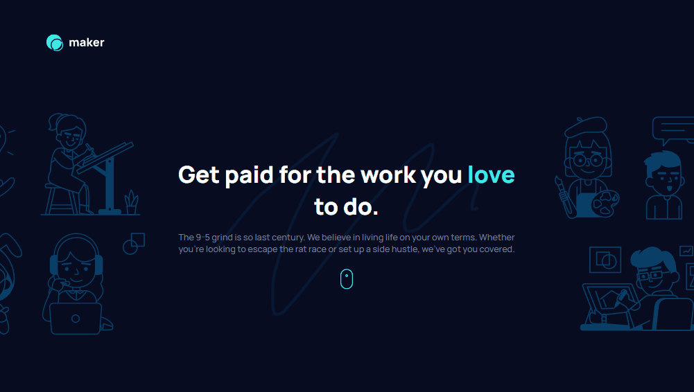
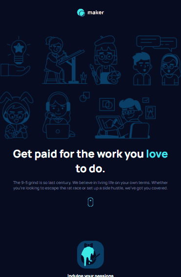
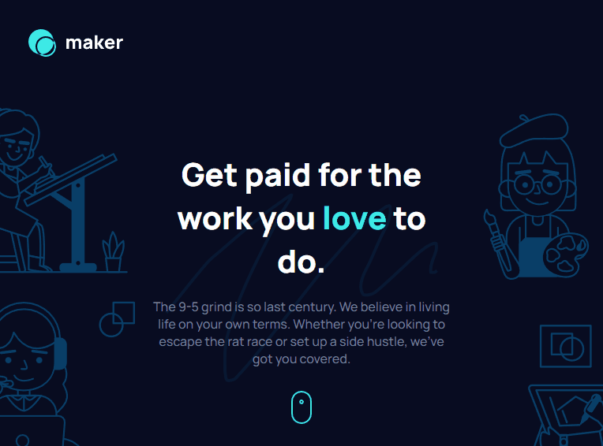

# Desafio Maker Landing Page - Frontend-Mentor

Este é um desafio de uma landing page para a Maker, proposto pelo site Frontend-Mentor.

## Tabela de Conteúdos

- [Visão Geral](#visão-geral)
    - [Imagens](#imagens)
    - [Link da página](#link)
- [Processo](#processo)
    - [Linguagens utilizadas](#linguagens-utilizadas)
    - [O que aprendi](#o-que-aprendi)
    - [Possíveis evoluções](#possíveis-evoluções)
- [Autor](#autor)

## Visão-geral

### Imagens

<br>

````
Versão de Desktop
````

   

<br>

````
Versão Mobile
````

 

<br>

````
Versão Tablet
````

 

### Link

- Página no GitHub Pages: <a href="https://julio-mansan2.github.io/maker-landing-page/">Clique aqui!</a>

## Processo

### Linguagens utilizadas

<br>

- Marcações semânticas de HTML5
- Propriedades de customização do CSS3
- Estruturas de JavaScript

<br>

### O que aprendi

<br>

- Validar um campo input:

````javascript

const inputEmail = document.querySelector('#input-email')
const inputSubmit = document.querySelector('#submit')
const error = document.querySelector('.error')

inputSubmit.addEventListener('click', function () {
    event.preventDefault()
    if (inputEmail.validity.valid === true) {
        error.innerHTML = ''
        inputEmail.style.border = 'none'
    } else if (inputEmail.validity.valid === false) {
        error.innerHTML = 'Oops! That is not a valid email'
        inputEmail.style.border = '1px solid var(--red)'
    }

    if (inputEmail.value == '') {
        error.innerHTML = 'Please, insert a valid email'
        inputEmail.style.border = '1px solid var(--red)'
    }
})

````

<br>

### Possíveis evoluções

<br>

- Códigos compactos;
- Posicionamento com position:absolute;
- Utilização de medições manuais.

<br>

## Autor

GitHub - <a href="https://github.com/julio-mansan2">julio-mansan2</a> <br>
Front-end Mentor - <a href="https://www.frontendmentor.io/profile/julio-mansan2">julio-mansan2</a> <br>
LinkedIn - <a href="https://www.linkedin.com/in/j%C3%BAlio-a-mansan-3415a7249/">Júlio A.</a> <br>